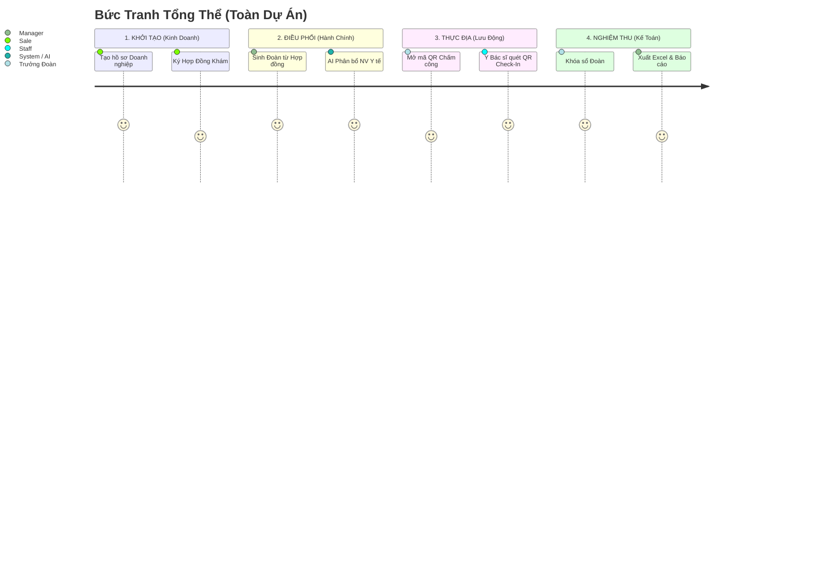

# 🏥 QUY TRÌNH VẬN HÀNH: QUẢN LÝ ĐOÀN KHÁM AN PHÚC

> **Mục tiêu:** Mượt mà - Tối giản - Bảo mật. Số hóa toàn bộ giấy tờ bằng AI và QR Code.

## 🔄 CHUỖI VẬN HÀNH CỐT LÕI

---

## 📋 4 GIAI ĐOẠN CHI TIẾT (NGẮN GỌN)

| Bước | Vai trò | Thao tác trên Hệ thống | 🌟 Tính năng Tiêu biểu |
| :--- | :---: | :--- | :--- |
| **1. KINH DOANH** | 👔 **Sale** | Vào **Khách Hàng** tạo Công ty -> Vào **Hợp Đồng** nhập KPI số người khám. | Upload thẳng File Hợp đồng PDF/DOCX lên Server để tra cứu. |
| **2. KẾ HOẠCH** | 👔 **Manager** | Vào **Đoàn Khám** -> Bấm **TẠO ĐOÀN TỰ ĐỘNG**. | Phần mềm quét dữ liệu và tự chẻ Hợp đồng lớn thành các đoàn nhỏ. |
| **3. ĐIỀU PHỐI (AI)**| 🤖 **AI System** | Trưởng đoàn thêm vị trí (Siêu âm, Khám ngoại...) -> Bấm **AI COPILOT GỢI Ý**. | Quét qua 100 nhân viên, loại bỏ người bận, tự động phân Bác sĩ vào đúng vị trí theo tỷ lệ 1:15 người. |
| **4. THỰC ĐỊA & QR**| 📳 **Toàn đội** | Trưởng đoàn chiếu **MÃ QR CHẤM CÔNG** lên máy tính >> Bác sĩ rút ĐT ra quét. | Mã QR sinh động đi kèm Token thay đổi liên tục chống gian lận chấm công. |

---

## 🔐 MA TRẬN PHÂN QUYỀN (Ai làm việc nấy)

Để dữ liệu không bị lộ chéo, phần mềm đã "chia khóa" cực kỳ hà khắc:

*   👑 **Admin:** Cầm chùm chìa khóa. Thấy và sửa mọi thứ.
*   👔 **Management (Quản lý/Trưởng đoàn):** Được phép tạo Đoàn, gọi AI, Mở màn hình QR. Xem được bảng lương.
*   🩺 **Medical Staff (Y Bác sĩ, KTV):** Màn hình bị **tắt tối thui hết các chức năng thừa**. Chỉ hiện duy nhất bảng **Lịch Của Tôi** và nút bật Camera để quét QR Check-in đi làm.
*   👨‍💼 **HR (Nhân Sự):** Cầm thẻ thêm/sửa/xóa nhân viên, cập nhật ảnh Avatar. Tuyệt đối không được can thiệp vào Đoàn Khám.
