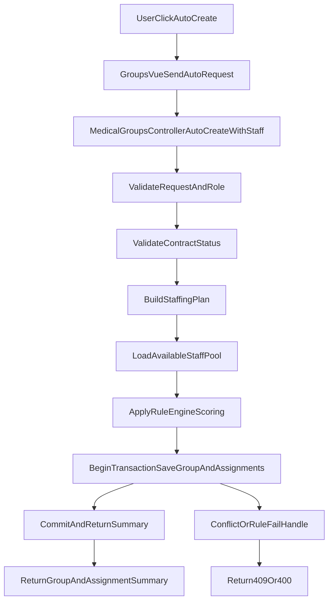

# Implementation Spec: Quan ly Doan kham + Tu dong tao Doan + Tu dong them nhan su

## 1. Thong tin chung

### 1.1 Muc tieu
Xay dung luong backend-first cho tinh nang:
- Tao doan kham tu hop dong hop le.
- Tu dong phan bo nhan su ngay khi tao doan (khong phu thuoc frontend loop tung nhan su).
- Bao dam tinh toan ven du lieu (tranh partial success), dung rule nghiep vu, de theo doi va de kiem thu.

Muc tieu chat luong:
- Atomic flow cho create + auto-assign.
- Ket qua phan bo co tinh quy tac (deterministic), co fallback ro rang.
- Frontend co 1 nut thao tac "tao + phan bo tu dong", van giu duoc che do thu cong.

### 1.2 Hien trang kien truc lien quan
- Backend API: `QuanLyDoanKham.API`
  - `Controllers/MedicalGroupsController.cs` dang chua ca logic tao doan, gan nhan su, AI suggest.
  - `Data/ApplicationDbContext.cs` quan ly `MedicalGroups`, `GroupStaffDetails`, `Contracts`, `Staffs`.
  - `DTOs/MasterDataDtos.cs`, `DTOs/DetailDtos.cs` chua cac DTO hien tai.
  - `Models/Entities.cs` chua domain model.
- Frontend Web: `QuanLyDoanKham.Web`
  - `src/views/Groups.vue` dang tao doan va apply AI suggest bang cach goi `POST /staffs` tung ban ghi.
  - `src/views/Staff.vue` va router role guard lien quan user flow.

### 1.3 File bi anh huong (du kien)
Bat buoc:
- `QuanLyDoanKham.API/Controllers/MedicalGroupsController.cs`
- `QuanLyDoanKham.API/Data/ApplicationDbContext.cs`
- `QuanLyDoanKham.API/DTOs/DetailDtos.cs`
- `QuanLyDoanKham.API/DTOs/MasterDataDtos.cs`
- `QuanLyDoanKham.API/Models/Entities.cs`
- `QuanLyDoanKham.Web/src/views/Groups.vue`

Nen tao moi:
- `QuanLyDoanKham.API/Services/MedicalGroups/IMedicalGroupAutoAssignmentService.cs`
- `QuanLyDoanKham.API/Services/MedicalGroups/MedicalGroupAutoAssignmentService.cs`
- `QuanLyDoanKham.API/DTOs/MedicalGroupAutoDtos.cs`
- Migration moi trong `QuanLyDoanKham.API/Migrations/*`
- Test files backend cho unit/integration (neu chua co test project thi tao project test rieng theo solution .NET).

Khuyen nghi mo rong (neu can):
- `QuanLyDoanKham.API/Services/MedicalGroups/AssignmentRuleEngine.cs`
- `QuanLyDoanKham.API/Services/MedicalGroups/AssignmentAuditService.cs`

---

## 2. Yeu cau ky thuat cot loi

### 2.1 Tong quan thay doi chinh
Can them mot endpoint command cap backend, xu ly tron goi:
1) validate hop dong  
2) tao `MedicalGroup`  
3) lap ke hoach phan bo nhan su  
4) persist toan bo assignment trong transaction  
5) tra ket qua tong hop cho UI

Khong dung flow "frontend lap for -> POST tung staff" cho auto mode nua.

### 2.2 Thay doi API contract (them moi)
Them endpoint:
- `POST /api/MedicalGroups/auto-create-with-staff`

Request de xuat:
```json
{
  "healthContractId": 123,
  "groupName": "Doan 01 - ABC - 04/2026",
  "examDate": "2026-04-15",
  "assignmentMode": "strict",
  "targetRatio": 18,
  "minimumDoctors": 2,
  "allowReuseAiSuggestion": false,
  "idempotencyKey": "uuid-client-generated"
}
```

Y nghia:
- `assignmentMode`:  
  - `strict`: thieu nguon luc -> fail toan bo  
  - `partial`: tao doan + gan duoc ai thi gan, tra danh sach thieu
- `targetRatio`: quy mo kham / 1 nhan su (mac dinh 15-20).
- `idempotencyKey`: tranh double-click tao trung.

Response de xuat:
```json
{
  "group": { "groupId": 456, "groupName": "...", "status": "Open" },
  "summary": {
    "requiredHeadcount": 12,
    "assignedCount": 10,
    "missingCount": 2,
    "mode": "partial"
  },
  "assignedStaff": [
    { "staffId": 1, "workPosition": "Kham noi", "shiftType": 1.0, "reason": "Available + skill match" }
  ],
  "unassignedReasons": [
    { "staffId": 9, "reason": "Date conflict" }
  ],
  "warnings": [
    "Thieu 1 BacSi cho tram Kham ngoai"
  ]
}
```

### 2.3 Server-side business rules bat buoc
Phai enforce o backend, khong chi o UI:
1. Contract phai `Approved` hoac `Active`.
2. Group moi tao mac dinh `Status = Open`.
3. Nhan su khong duoc trung lich ngay (`ExamDate`) voi doan khac.
4. `BacSi` khong duoc vao vi tri: `Tiep nhan`, `Can do huyet ap`, `Lay mau`, `Hau can`, `Khac`.
5. Danh sach `workPosition` phai thuoc controlled list (khong cho string tuy y).
6. Chinh sach workload can bang:
   - Uu tien nguoi co it lich hon (tong assignment trong 30 ngay gan nhat).
   - Uu tien match `StaffType`/`Specialty`.
7. Neu `strict` va khong dat minimum composition (vi du so bac si toi thieu) -> rollback.

### 2.4 Assignment strategy (deterministic, khong mo ho)
Trinh tu chon nhan su:
1. Loc theo availability (khong conflict ngay).
2. Loc theo role fit cho tung tram.
3. Sap xep theo diem:
   - `+40` match specialty
   - `+30` staffType dung tram
   - `+20` it assignment gan day
   - `+10` isActive/uu tien nhan su noi bo (neu co flag)
4. Chon top N theo requirement moi tram.

Can co bang requirement co ban (co the tinh chinh qua config):
- Tiep nhan: 1-2 DieuDuong/Khac
- Can do huyet ap: 1-2 DieuDuong
- Kham noi: >=1 BacSi
- Kham ngoai: >=1 BacSi
- Lay mau: >=1 DieuDuong/KyThuatVien
- Sieu am: >=1 BacSi hoac KTV sieu am
- Kham san phu khoa: tuy hop dong (optional or >=1 BacSi)
- Hau can: 1 Khac/DieuDuong

### 2.5 Tinh toan ven du lieu va dong thoi
Yeu cau bat buoc:
- Bao transaction boundary cho create-group va insert `GroupStaffDetails`.
- Truoc commit, re-check conflict bang query DB (khong tin state frontend).
- Them unique/index de giam race condition:
  - Index de xuat: `(StaffId, ExamDate)` tren bang phan cong (neu phu hop voi nghiep vu).
- Khi co conflict luc commit:
  - `strict`: rollback va tra 409.
  - `partial`: bo qua record xung dot, ghi warning.

### 2.6 Audit, trace, va an toan van hanh
Can bo sung metadata audit cho auto assignment:
- `CreatedBy`, `CreatedAt`, `AssignmentSource` (`Manual`, `AutoRule`, `AutoAI`), `AssignmentVersion`.
- Log su kien:
  - Bat dau tao auto group
  - So luong expected vs assigned
  - Danh sach rule fail chinh
- Khong ghi log secret/token/PII nhay cam.

### 2.7 Thay doi frontend bat buoc
Trong `Groups.vue`:
1. Them action 1-click goi endpoint moi `auto-create-with-staff`.
2. Hien thi ket qua `summary`, `warnings`, `unassignedReasons`.
3. Neu `partial`, cho phep user mo modal de bo sung thu cong.
4. Khoa nut submit trong khi request dang chay, tranh double submit.
5. Su dung `idempotencyKey` moi lan submit.

Dong bo logic contract filter:
- Hien tai frontend filter `Approved`, backend cho `Approved/Active`.  
=> can dong bo de khong gay mismatch.

### 2.8 Nhung phan can sua/xoa ro rang
Can giam phu thuoc vao flow cu:
- Khong de `applyAiSuggestions` tiep tuc la core flow cho auto-create.
- Co the giu `ai-suggest-staff` cho che do "goi y", nhung khong phai flow chinh.
- Tach logic assignment khoi controller sang service; controller chi con validate input va call service.

---

## 3. Huong dan thuc thi tung buoc (Step-by-step checklist)

### Phase A - Chuan bi domain va DTO
- [ ] Tao DTO moi: `AutoCreateGroupWithStaffRequestDto`, `AutoCreateGroupWithStaffResponseDto`.
- [ ] Chuan hoa enum/string constant cho:
  - group status
  - assignment mode
  - work positions
  - staff types
- [ ] Bo sung validation attribute cho request (required, range, allowed values).

### Phase B - Service layer hoa auto assignment
- [ ] Tao interface `IMedicalGroupAutoAssignmentService`.
- [ ] Tao class `MedicalGroupAutoAssignmentService`:
  - [ ] `ValidateContractAsync`
  - [ ] `BuildStaffingRequirements`
  - [ ] `GetAvailableStaffPoolAsync`
  - [ ] `ComputeAssignmentPlan`
  - [ ] `PersistGroupAndAssignmentsAsync` (transaction)
- [ ] DI service trong `Program.cs`.

### Phase C - Endpoint moi va mapping controller
- [ ] Them endpoint `POST /api/MedicalGroups/auto-create-with-staff`.
- [ ] Gan role authorize: `Admin,MedicalGroupManager`.
- [ ] Tra response schema thong nhat (summary + warnings + missing).
- [ ] Xu ly status code:
  - [ ] 200/201 thanh cong
  - [ ] 400 input invalid/rule invalid
  - [ ] 404 contract/staff resource not found
  - [ ] 409 data conflict (strict mode)

### Phase D - Data integrity va migration
- [ ] Danh gia can them cot metadata assignment trong `GroupStaffDetails` hoac bang audit rieng.
- [ ] Tao migration:
  - [ ] them cot/index can thiet
  - [ ] cap nhat snapshot
- [ ] Dam bao migration rollback an toan.

### Phase E - Frontend integration
- [ ] Cap nhat `Groups.vue` them form config cho auto mode (`strict/partial`, ratio, min doctor).
- [ ] Goi endpoint moi 1 lan duy nhat cho full flow.
- [ ] Render ket qua sau khi tao:
  - [ ] danh sach da gan
  - [ ] canh bao thieu nhan su
  - [ ] nut bo sung thu cong
- [ ] Cap nhat UX state loading + disable buttons + retry.

### Phase F - Testing
- [ ] Unit test cho rule engine scoring/chon staff.
- [ ] Integration test endpoint auto-create-with-staff:
  - [ ] contract invalid
  - [ ] strict fail -> rollback
  - [ ] partial success -> co warning
  - [ ] conflict race -> handle 409/partial
- [ ] UI smoke:
  - [ ] tao doan + auto assign thanh cong
  - [ ] hien warning dung
  - [ ] manual add bo sung van chay

### Phase G - Hardening va docs
- [ ] Them structured logs cho auto flow.
- [ ] Cap nhat README module hoac docs noi bo cho endpoint moi.
- [ ] Viet release note ngan cho thay doi API contract.

---

## 4. Tieu chi nghiem thu (Security + Testing + Rules)

### 4.1 Security rules bat buoc
1. Endpoint auto-create-with-staff phai co `[Authorize(Roles = "Admin,MedicalGroupManager")]`.
2. Khong trust data tu frontend:
   - Validate `workPosition`, `shiftType`, `mode`.
3. Idempotency:
   - Cung `idempotencyKey` trong cua so thoi gian ngan khong tao duplicate group.
4. Khong de lộ thong tin nhay cam qua error message.
5. Log audit co user context, nhung khong log token/secret.

### 4.2 Functional acceptance
1. User role hop le co the tao doan + auto assign trong 1 request.
2. Rule conflict ngay hoat dong dung.
3. Rule bac si/vi tri hoat dong dung.
4. Strict mode rollback toan bo neu khong dat minimum composition.
5. Partial mode tao doan va tra danh sach thieu ro rang.
6. Frontend hien thi ket qua va cho phep bo sung thu cong.

### 4.3 Performance acceptance
1. 1 request auto assignment khong thuc hien N+1 query nghiem trong.
2. Query staff availability co index hop ly.
3. Endpoint khong timeout voi pool nhan su kich thuoc vua (vd 200-500 records).

### 4.4 Test matrix toi thieu
Backend Unit:
- [ ] Position compatibility scorer
- [ ] Workload balancing scorer
- [ ] Requirement calculator theo `ExpectedQuantity`

Backend Integration:
- [ ] Happy path strict
- [ ] strict + thieu bac si -> rollback
- [ ] partial + thieu nhan su -> success with warning
- [ ] double submit same idempotency key
- [ ] concurrency conflict khi co request dong thoi

Frontend:
- [ ] Button state loading/disable
- [ ] Render summary + warnings
- [ ] fallback manual assign after partial

---

## 5. Dinh huong logic va code hotspots (khong viet full code)

### 5.1 Backend flow de xuat (Mermaid)


### 5.2 Hotspots can sua truoc
1. `MedicalGroupsController.cs`
   - Them endpoint command moi.
   - Giam logic phan bo trong controller; goi service.
2. Service layer moi
   - Chua toan bo rule engine + transaction persist.
3. `Groups.vue`
   - Chuyen from loop API to single-command API.
4. `ApplicationDbContext` + migration
   - Bo sung index/field metadata neu can.

### 5.3 Pseudo-logic cot loi (tham khao)
```text
if contract not in [Approved, Active] => fail
requirements = buildRequirements(expectedQuantity, minDoctors, targetRatio)
pool = getAvailableStaff(examDate, isActive=true)
plan = assignByRules(pool, requirements)

if mode == strict and !plan.meetMinimum:
    rollback + return 409/400

begin transaction
    create MedicalGroup(status=Open)
    insert GroupStaffDetails from plan.selected
commit

return summary(selected, missing, warnings)
```

### 5.4 Non-goals (de tranh scope creep)
- Khong can thay toan bo module AI Gemini.
- Khong can refactor tong the tat ca controller trong 1 task.
- Khong can viet lai toan bo UI Groups; chi can bo sung flow moi va giu tuong thich flow cu.

### 5.5 Danh sach verify cuoi cung truoc khi merge
- [ ] Build backend pass.
- [ ] Migration apply/revert OK tren moi truong local.
- [ ] Test matrix toi thieu pass.
- [ ] Frontend smoke pass cho create + auto-assign + manual override.
- [ ] Khong pha vo endpoint cu (`POST /api/MedicalGroups`, `POST /api/MedicalGroups/{id}/staffs`).

